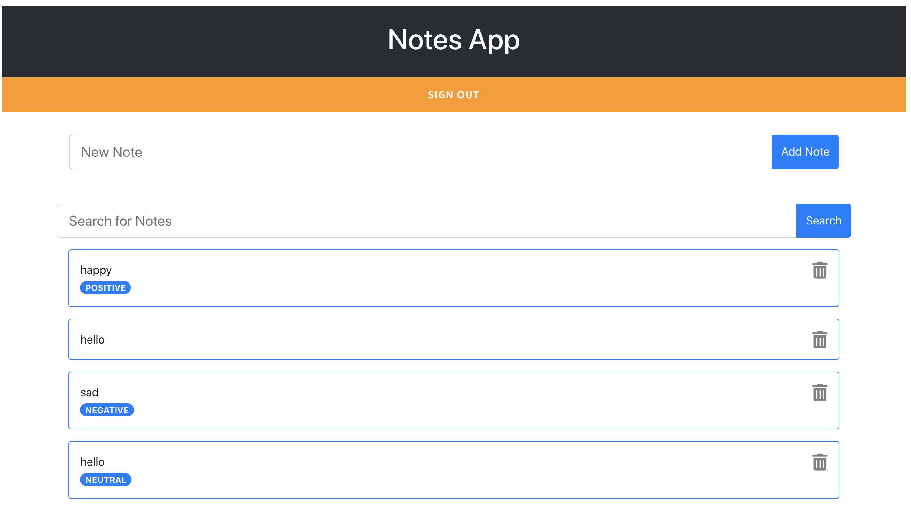

# Adding Artificial Intelligence to our app

Let's add some artificial intelligence (AI) to our app.
We are going to use a service called Amazon Comprehend to add sentiment analysis to our notes.

Amazon Comprehend will analyse the note text and provide a result, saying that the text is "POSITIVE", "NEUTRAL" or "NEGATIVE". Amazon Comprehend is an AWS service and using it with Amplify is very simple.

We need to decide when to call the service AWS Comprehend to get the sentiment for the note. We have many ways of doing this.

One way is to call it when we create the note and store the sentiment analysis with the note. And here we can call it in the client application or from the backend. If we do it from the backend we make sure that everytime we add a new note to the application we are getting the sentiment for this note. If we do it in the client, we need to make 2 calls to the AWS cloud. If we do it when we add the note, then all the old notes won't get it sentiment analysed.

Another option is to do it everytime we get the notes from the API, we will be calling the service AWS Comprehend a lot in this way, but older notes will get their text analysed.

If I would be building for a production application I will choose to do it on the backend, everytime we create a new note. But is not what we are going to do today, as this is the more complext option. I will be doing it everytime we add a new note from the client, so I can show to you how to do it with Amplify.

## Building the backend

1. The first thing we want to do is to add the category predictions to our application.

```
amplify add predictions
```

2. When we are prompt a message to choose we pick "Interpret" and then "Interpret text".

3. Then we need to provide a friendly name for the resource. Leave the default.

4. Then it ask what kind of interpretation we want. We can choose all so we can see what this service return.

5. And when it ask for access, select the option "Auth users only".

6. Then we need to modify our API. Now we will add to the API a new attribute for the note, that is the sentiment. So everytime we create a new note the sentiment of the note is stored in the database with the content of the note.

For that we need to modify the existing GraphQL schema. Go to the folder "amplify --> backend --> api --> notesapp" and there you will find a file called schema.graphql. Modify it to look like this.

```
type Note
@model
@auth(rules: [{ allow: owner }])
@key(
  fields: ["owner", "note"]
  queryField: "notesByOwner"
  name: "ownerIndex"
) {
  id: ID!
  note: String!
  owner: String
  sentiment: String
}
```

You can also copy it from the base directory.

```
cp ../base/schema-03.graphql amplify/backend/api/notesapp/schema.graphql
```

7. Now we need to push the changes to the cloud and for that we run:

```
amplify push
```

We accept everything and we wait until it completes.

## Building the frontend

1. First we need to configure the new Prediction library in our application for that we are going to import it and also to configure a plugin.

In the App.js, in the top of the file you need to add these lines.

```
import Predictions, { AmazonAIPredictionsProvider } from '@aws-amplify/predictions';

Amplify.addPluggable(new AmazonAIPredictionsProvider());
```

Then we are ready to start using this library.

2. In the App.js we will modify the add note method, to call the prediction API everytime we add a new note.
   And also we save that to the database

```
  addNote = async (note) => {
    const noteAnalysis = await Predictions.interpret({
      text: {
        source: {
          text: note.note,
        },
        type: "ALL",
      },
    });
    var newNote = note;
    newNote.sentiment = noteAnalysis.textInterpretation.sentiment.predominant;

    var result = await API.graphql(
      graphqlOperation(createNote, { input: newNote })
    );
    this.state.notes.push(result.data.createNote);
    this.setState({ notes: this.state.notes });
  };
```

3. Then in the NotesList component we need to add that label to the note, add this after the trash button.

```
              <span className="badge badge-pill badge-primary">
                {note.sentiment}
              </span>
```

If you want you can copy paste the final file from the base directory

```
cp ../base/App-05.js src/App.js
```

## Trying it out

Now you can go to the webpage and see what is going on. Add a couple of notes and this is what you will see.



The old notes won't have a label and the new notes will do have one, that shows the sentiment of the text in that note.

### Next

[Publishing the app](deploy-app.md)
