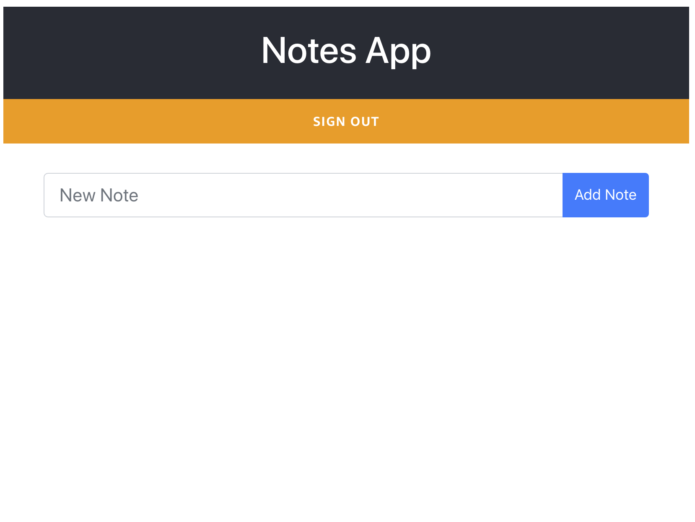

# Add GraphQL API

## Setting up the backend - AWS AppSync

To build our API we’ll use AWS AppSync, a managed GraphQL service for building data-driven apps. If you’re not yet familiar with the basics of GraphQL, you should take a few minutes and check out https://graphql.github.io/learn/ before continuing, or use the site to refer back to when you have questions as you read along.

1. Type in the notes-app directory:

```
amplify add api
```

2. Select GraphQL when asked

3. Leave the default API name: notesapp

4. Choose the default authorization for the API: Pick "Amazon Cognito User Pool"

5. Select "No, I am done" for advanced settings.

6. Select No when asked for annotated GraphQL schema.

7. Select "Single object with fields..."

8. Select "Yes" when asked if you want to edit the schema now.

If you aren't using Cloud9, copy this schema in the schema.graphql file that pops up and save it.
If you are using Cloud9, the file won't open itself. You can find it by browsing to "amplify --> backend --> api --> notesapp"  in the directory explorer on the left and double-clicking on it, and then pasting the schema from below into it, and saving it.

```
type Note @model @auth(rules: [{allow: owner}]) {
id: ID!
note: String!
}
```

You can also find the schema in ../base/schema-01.grahql file

```
cp ../base/schema-01.graphql amplify/backend/api/notesapp/schema.graphql
```

9. Return to the terminal and press Enter

This is what you just did looks:

```
notes-app $amplify add api

? Please select from one of the below mentioned services: GraphQL

? Provide API name: notesapp
? Choose the default authorization type for the API Amazon Cognito User Pool
Use a Cognito user pool configured as a part of this project.

? Do you want to configure advanced settings for the GraphQL API No, I am done.

? Do you have an annotated GraphQL schema? No
? Choose a schema template: Single object with fields (e.g., “Todo” with ID, name, description)

The following types do not have '@auth' enabled. Consider using @auth with @model
         - Todo
Learn more about @auth here: https://docs.amplify.aws/cli/graphql-transformer/directives#auth


GraphQL schema compiled successfully.

? Do you want to edit the schema now?
Yes

Please manually edit the file created at /notes-app/amplify/backend/api/notesapps/schema.graphql

? Press enter to continue
```

9. Then push the changes to the cloud. Accept all the defaults and continue. This process will create the API in the cloud, and generate the code in your project you need to use it.

```
$ amplify push
```

## Setting up the frontend

When Amplify CLI finished adding all the resources in the cloud. Its time to get to work on the frontend.

1. You can copy this files to get the frontend looking right.

```
cp ../base/App-03.js src/App.js
cp ../base/App-03.css src/App.css
```

Now your page should look like this:



2. Now you can create notes, they will appear in a list and also you can delete them. Play a bit with the UI.

So what have we done when we copied the App-03.js file?

You will see these new imports:

```

import Amplify, { API, graphqlOperation } from 'aws-amplify';
import { listNotes } from './graphql/queries';
import { createNote, deleteNote } from './graphql/mutations';
```

What makes a lot of this really convenient is that Amplify took care of generating common GraphQL query, mutation, and subscription statements for us, which we imported and used in our new React components. These are just pre-generated GraphQL operations represented as strings that we use to interact with the API that Amplify generated for us based on the @model annotations we supplied in the schema.graphql file.

And also new components like AddNote and ListNote. Those are UI components, the main logic for them is in the App component. There we have these 3 methods.

```
async componentDidMount(){
    var result = await API.graphql(graphqlOperation(listNotes));
    this.setState( { notes: result.data.listNotes.items } )
  }

  deleteNote = async (note) => {
    const id = {
      id: note.id
    }
    await API.graphql(graphqlOperation(deleteNote, {input:id}));
    this.setState( { notes: this.state.notes.filter( (value, index, arr) => { return value.id !== note.id; }) } );
  }

  addNote = async (note) => {
    var result = await API.graphql(graphqlOperation(createNote, {input:note}));
    this.state.notes.push(result.data.createNote)
    this.setState( { notes: this.state.notes } )
  }
```

In these methods you can see that we are using the Amplify client library to access the GraphQL API in a simple way.

### Next

[Add Search](add-search.md)
