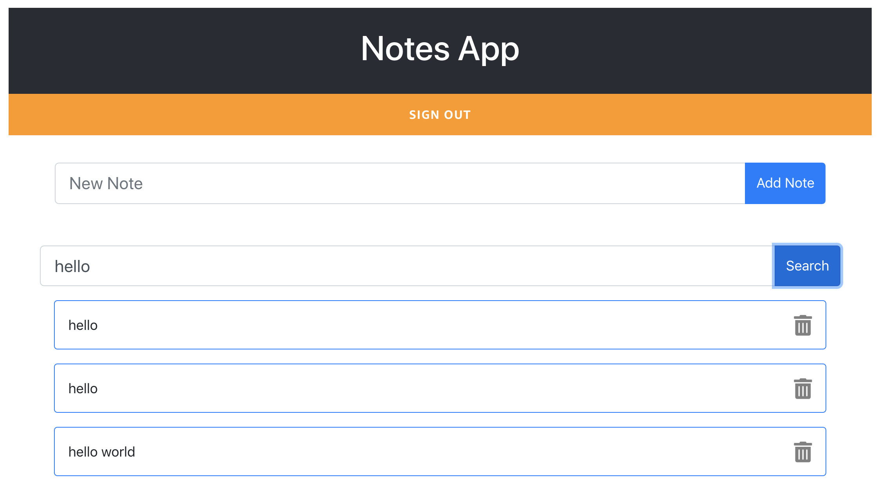

# Adding search

Now we will add search to our app. We have a couple of ways to do it.

We can use a service called Amazon ElasticSearch that will allow us to create a search index and do very complex search queries.

Or we can use the power that there is in DynamoDB to provide more simple search queries without adding an extra component.

Amazon ElasticSearch is a great service if you need complex queries and it is fully integrated to AWS Amplify.
Check the [searchable directive](https://docs.amplify.aws/cli/graphql-transformer/directives#searchable) for more info. The main problem with Amazon ElasticSearch service is that is not a serverless service, it will be running all the time, no matter if we are searching or not.

If we choose DynamoDB to provide search capabilities we can get search results in miliseconds and we can embrace the serverless architecture, however the queries we can do are a bit more limited.

For this use case we are using DynamoDB. We will create a simple search that will allow us to search for the text in our notes. The limitation is that we can only get results for notes that begin with the desired search word.

## Modifying the GraphQL API

1. We need to modify the GraphQL API and for that we just go to our existing schema.graphl file that you can find in the /amplify/backend/api directory.

There we want to change it to look something like this:

```
type Note
@model
@auth(rules: [{ allow: owner }])
@key(
  fields: ["owner", "note"]
  queryField: "notesByOwner"
  name: "ownerIndex"
) {
  id: ID!
  note: String!
  owner: String
}
```

You can find the lastest version of the file in the base directory ../base/schema-02.graphql.

```
cp ../base/schema-02.graphql amplify/backend/api/notesapp/schema.graphql
```

You see that we added a @key annotation to the graphQL type. You can find more information about this annotation in the [Amplify docs](https://docs.amplify.aws/cli/graphql-transformer/directives#key).

Basically this annotation will create a secondary index in our DynamoDB table, that will allow us to do search in our notes in a more efficient way.

2. After modifying the schema.graphql file we need to update the table in the cloud, for doing that we just run:

```
amplify push
```

As always we accept all the defaults; this will also recreate the code we use locally to interact with the API. 

When this process ends now we will have a new query available in our AppSync and also a new global secondary index in DynamoDB.

## Modifying the frontend

Now we need to do some changes in our App.js to add the search box and call the new API.

1. Replace the App.js with the file App-04.js that is in the base folder.

```
cp ../base/App-04.js src/App.js
```

In that file you will see some main changes.

In the import section, now we import the Auth library from Amplify and the notesByOwner query from the autogenerated files.

```
import Amplify, { Auth, API, graphqlOperation } from "aws-amplify";
import { listNotes, notesByOwner } from "./graphql/queries";
```

We created a new component, the SearchNote component. This is a visual component that basically will add a new text box and a button to our page so we can do searches.

And then we added a new method to the App main component, the searchNote method.

```
searchNote = async (note) => {
    var result;

    // when no search filter is passed, revert back to full list
    if (note.note === "") {
      result = await API.graphql(graphqlOperation(listNotes));
      this.setState({ notes: result.data.listNotes.items });
    } else {
      // search

      const owner = await Auth.currentAuthenticatedUser();
      console.log(owner);

      const input = {
        owner: owner.username,
        note: {
          beginsWith: note.note,
        },
      };
      console.log(input);
      result = await API.graphql(graphqlOperation(notesByOwner, input));

      console.log(result);
      if (result.data.notesByOwner.items.length > 0) {
        this.setState({ notes: result.data.notesByOwner.items });
      } else {
        // no search result, print help
        this.setState({
          notes: [
            {
              id: "-1",
              note: "No Match: Clear the search to go back to your Notes",
            },
          ],
        });
      }
    }
  };
```

Here we are doing lots of things but the most important is calling the new query notesByOwner where there is some text in the search bar.

In order to call this query we need to know the name of the owner and that we will get with the Auth library and the "currentAuthenticatedUser" method.

The notesByOwner method returns a list of notes that match the search criteria and shows them in the list component.



### Next

[Add AI](add-ai.md)
