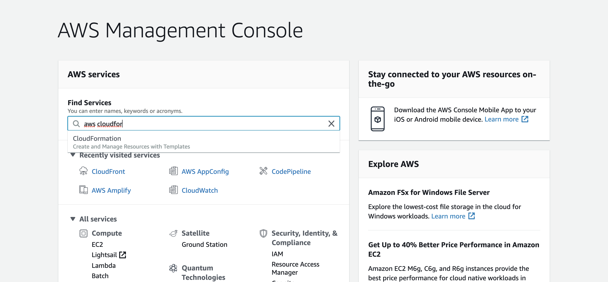
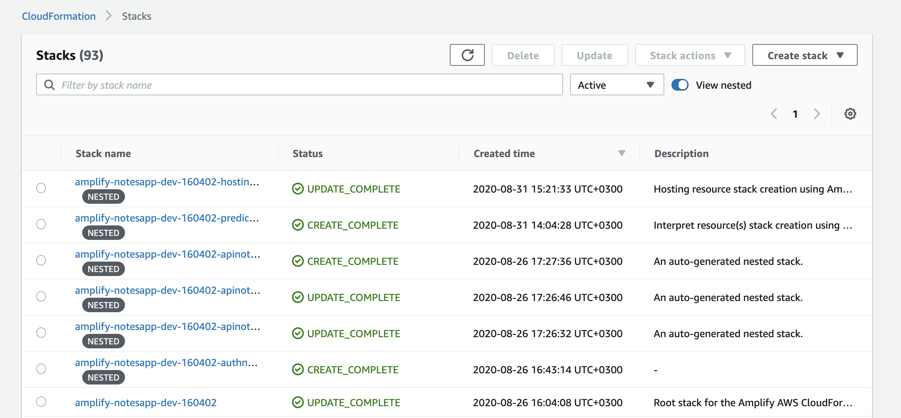

# Cleaning up after the workshop

When you are finished with the workshop, it is time to delete everything from your AWS account.

Nothing on the workshop should cost you, but is a good practice to remove everything we just build from your AWS account.

After doing this, everything will be removed including the data.

1. Log in to your AWS account, in the same region that you deployed your application.

2. Go to a service called CloudFormation.

3. Inside cloudformation, you should have multiple stacks that are prefixed with the name "amplify-notesapp".

4. Select the one that doesn't have the nested word.

5. Then click on the delete button and wait for all the stacks to get deleted. This will take a while.

6. You are done!
