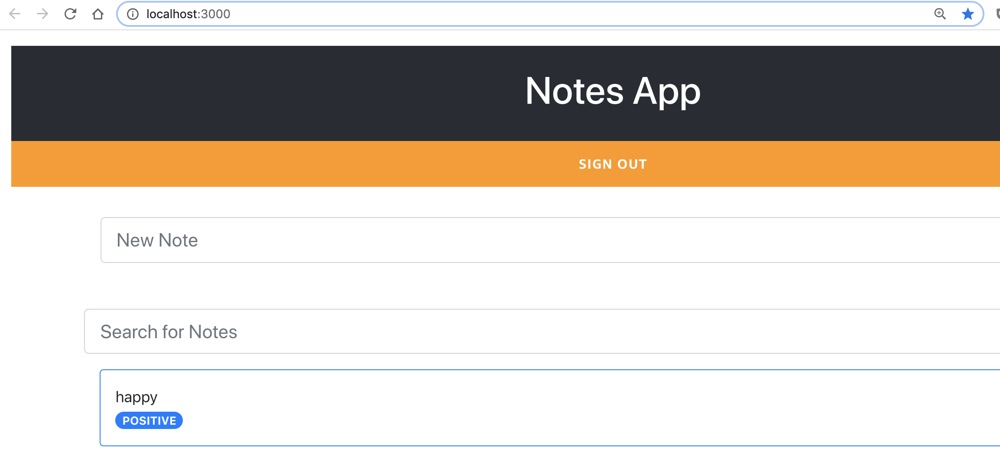

# Deploying the application to the cloud

Now we have finalized our web app. We are ready to publish it.

You might be thinking... well is not everything in the cloud already?

The answer is kind of, your backend is in the cloud, but your client is in your local machine. If you check your browser you can see that localhost is the address of your testing app.



We want that our client application is available in the cloud, so others can access it as well.

We have 2 options here. To do a local deployment or to deploy in a way that it creates a continous deployment pipeline for us.

For this demo I will show you the local deployment. But feel free to investigate the other way in your own time. You can find all the information in the [AWS Amplify docs] (https://docs.amplify.aws/guides/hosting/git-based-deployments/q/platform/js)

1. Lets run in our notes-app directory the command

```
     amplify add hosting
```

2. Then choose the option that says "Amazon CloudFront and S3"

3. Then choose the option "DEV". As we are doing this for a demo

4. Accept the default bucket name, index for the website, error docs for the website

5. Now we have created the configuration locally and we need to publish the app in the cloud. So we need to type:

```
amplify publish
```

You see here that we type publish and not push. Push only pushes the backend components to the cloud, while publish deploys all the components to the cloud - frontend and backend.

6. When this finishes you get back an URL - hosting endpoint. That is the link for your app in the cloud.

7. Open the URL in the browser and you are ready, your app is live in the cloud.

## Next

[Do you want more?](extra-challenges.md)
[Cleaning up](cleaning-up.md)
