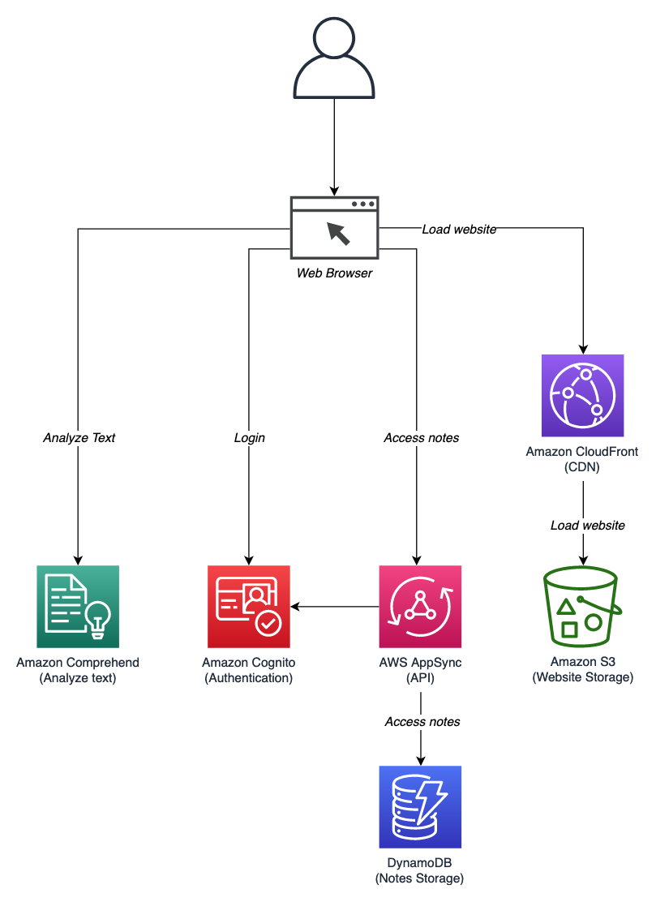

# What we will build

## Our goal

In this workshop, we’ll build an app with quite a few features, including:

- Allowing user sign up and authentication, all the notes are private to the owners

- Building an API server, so our front end has a way to load the appropriate notes given to an user.

- Storing data about notes, and permissions of who can view what, so that our API has a fast and reliable place to query and save data to

- Automatically detecting the sentiment of the notes uploaded.

- Being able to search for the content in the notes.

## The architecture

Here’s a map of the services we’ll use and how they’ll all connect.




## The tools

If we were to try and build scalable and highly-available systems to handle each of the above concerns on our own, we’d probably never get around to building our app!

Fortunately, AWS provides services and tooling to handle a lot of the undifferentiated heavy lifting involved in building modern, robust applications. We’ll use a number of these services and tools in our solution, including:

- The [AWS Amplify CLI](https://github.com/aws-amplify/amplify-cli), to rapidly provision and configure our cloud services

- The [AWS Amplify JavaScript library](https://aws-amplify.github.io/), to connect our front end to cloud resources

- [Amazon Cognito](https://aws.amazon.com/cognito/), to handle user sign up authorization

- [Amazon DynamoDB](https://aws.amazon.com/dynamodb/), to provide millisecond response times to API queries and to store all the notes

- [AWS AppSync](https://aws.amazon.com/appsync/), to host a GraphQL API for our front end

- [Amazon Comprehend](https://aws.amazon.com/comprehend/), we will use to find the sentiment of our notes

If any or all of these services are new to you, don’t worry. We’ll cover everything you need to know to get started using everything mentioned above. And there’s no better way to learn than to build, so let’s get started!

# Bootstraping the App

## Creating a React app

We’ll get things started by building a new React web app using the create-react-app CLI tool.

This will give us a sample React app with a local auto-reloading web server and some helpful transpiling support for the browser like letting us use async/await keywords, arrow functions, and more.

You can learn more about create-react-app at https://github.com/facebook/create-react-app.

1. In the Cloud9 terminal, run:

```
cd .. # MAKE SURE THAT YOU ARE IN workshop:~/environment $
npx create-react-app notes-app
```
When asked to `install the following packages?`, enter `y` to proceed.


2. Then, navigate to the newly created directory:

```
cd notes-app
```

3. Start the application. In the notes-app directory run:

```
npm start
```

4. Once the web server has started, click the Preview menu and select Preview Running Application


If you’d like, you can also pop the preview to a new window:


5. Finally, open another terminal window. We’ll leave this first terminal alone since it’s running the web server process.


## Installing dependencies

1. Let install Boostrap so we can make our web app look nicer.

If you are not inside the notes-app directory, please go in there

```
cd notes-app
npm install bootstrap@4.5.2
```

2. Then lets replace the index.html file with another one as we will need to add some stylesheets for later

```
cp ../base/index-01.html public/index.html
```

Nothing had change in the site in the browser.

### Next...

[Initialize the application with Amplify](initialize-app.md)
